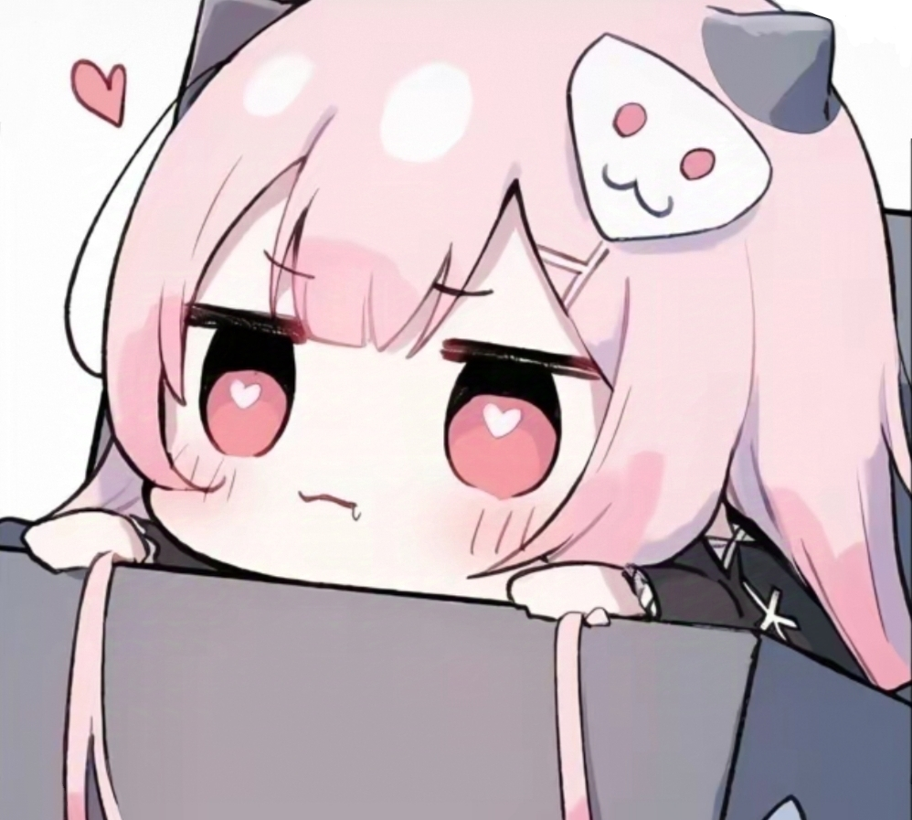

# Introduction

Hi! I'm Low En Dong, a Software Engineering student at Universiti Malaya.

- **Fun fact**: I enjoy playing games in my free time
- **Course expectations**: Through this course, I hope to learn how to understand existing
code, identify problems, and improve software as requirements
change. I would also like to learn how to work with legacy
systems and use testing to ensure that changes preserve
existing functionality.

